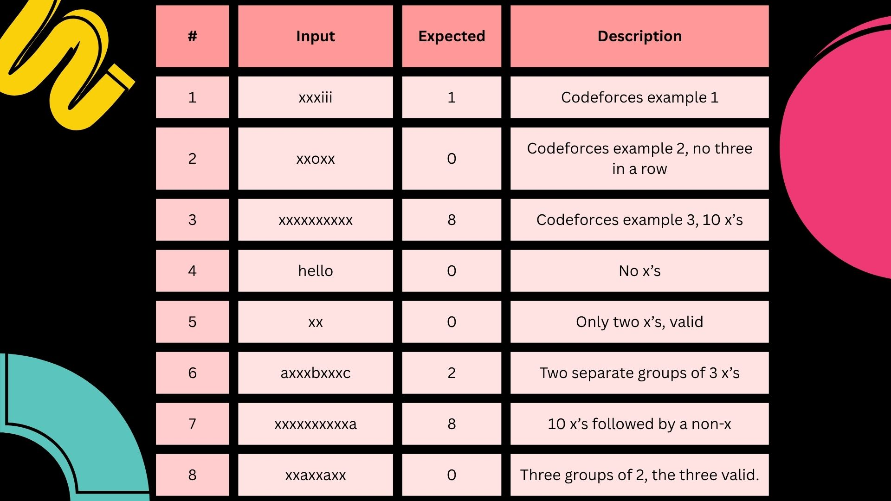

# Evidence 4: Demonstration of a Programming Paradigm
Leonardo Fuentes Bear - A01614731

---

# Context & Description

For this evidence, I have chosen to work with a Codeforces problem using the Logical Paradigm with the Prolog language. I chose Codeforces because it is a competitive programming platform maintained by ITMO University, with over 600,000 registered users and its problems come with a narrative context, a concrete input/output format, and well-defined constraints 

### Logical Paradigm

"The logical paradigm is a computational approach that aims to unify different areas of computing by utilizing the generality of logic" (Kowalski, 2014). It mainly consists in working with predicates formed by facts or rules, telling the program *what* needs to be true instead of *how* to compute it.

I choose the Codeforces problem 978B — File Name , which states the following:

**"When Polycarp tries to send a file, if the file name contains three or more consecutive `x` characters, the system rejects it. Determine the minimum number of characters to remove from the file name so it no longer contains `xxx` as a substring and print `0` if the name is already valid."**

**Input:** The first line contains integer `n` (3 ≤ n ≤ 100) — the length of the file name. Second line contains a string of `n` lowercase Latin letters — the file name.

**Output:** The minimum number of characters to remove from the file name so after that the name does not contain `xxx` as a substring. If initially the file name dost not contain a forbidden substring `xxx`, print `0`.

**Examples:**

Input: 6/xxxiii -> Output: 1

Input: 5/xxoxx -> Output: 1

Input: 10/xxxxxxxxxx -> Output: 1

.

Given that Codeforces does not support Prolog, the platform will not verify my answer directly. However, I will work with the same test cases from Codeforces plus additional ones to prove that the code works correctly.

---

# Logic

To solve this problem I use a recursive predicate `count_remove` that goes through the list of characters and keeps track of how many consecutive `x`'s have been seen.

The predicate has three clauses:

**Base case** — empty list, nothing to remove:

    count_remove([], _, 0).

**Removal clause** — current character is `x` and we already have 2 consecutive `x`'s. This third `x` must be deleted. The consecutive count stays at 2 so the next `x` will also be removed:

    count_remove([x|T], 2, R) :-
        count_remove(T, 2, R1),
        R is R1 + 1.

**Accumulation clause** — current character is `x` but count is still below 2. Increment the consecutive counter:

    count_remove([x|T], Count, R) :-
        Count < 2,
        NewCount is Count + 1,
        count_remove(T, NewCount, R).

**Reset clause** — current character is not `x`. Reset the consecutive counter to 0:

    count_remove([H|T], _, R) :-
        H \= x,
        count_remove(T, 0, R).

The entry predicate `solve` converts the atom to a character list and calls `count_remove`:

    solve(String, Removals) :-
        atom_chars(String, Chars),
        count_remove(Chars, 0, Removals).

The following diagram explains how the function works step by step for the input `xxxiii`:

```
count_remove([x,x,x,i,i,i], 0, R)
│
├─ char=x, count=0 → count_remove([x,x,i,i,i], 1, R)
│   │
│   ├─ char=x, count=1 → count_remove([x,i,i,i], 2, R)
│   │   │
│   │   ├─ char=x, count=2 → REMOVE +1, count_remove([i,i,i], 2, R1)
│   │   │   │
│   │   │   ├─ char=i → reset, count_remove([i,i], 0, R)
│   │   │   │   ├─ char=i → count_remove([i], 0, R)
│   │   │   │   │   └─ char=i → count_remove([], 0, 0)
│   │   │   │   └─ R = 0
│   │   │   └─ R1 = 0  →  R = 0 + 1 = 1
│   │   └─ R = 1
│   └─ R = 1
└─ Result: 1  ✓
```

---

# Tests

I have implemented 8 tests. Three come from the Codeforces problem statement and five additional cases:



To run the tests in SWI-Prolog:


    wpl paradigm.pl
    ?- solve(xxxiii, X).
    X = 1.

---

# Time & Space Complexity

**Time complexity: O(n)** — the predicate `count_remove` goes through the list, performing O(1) work per character.

**Space complexity: O(n)** — the maximum recursion depth equals the length of the input string `n`.

---

# Analysis

I chose the Logical Paradigm because this problem is a natural fit for it. The solution describes what a valid state is — "if I have seen 2 consecutive x's and the next character is also x, remove it". The three clauses of `count_remove` map directly to the three possible situations, and Prolog's unification selects the right clause automatically.

And by using the Logical Paradigm we do not need to pass the length of the string as an input, unlike the original problem. This is because `atom_chars` automatically converts the string to a character list, and the recursion stops naturally when the list is empty (Base case).

### Other solutions

To present an alternative solution, I chose the **Functional Paradigm** using the **Racket** language. Functional programming is a paradigm rooted in lambda calculus, where computation is expressed through function application and immutable data transformations (Aguirre, 2025). It avoids shared state and side effects.

The Racket solution mirrors the Prolog logic using a recursive function:

    #lang racket

    (define (count-remove lst consec)
      (cond
        [(null? lst) 0]
        [(and (equal? (car lst) #\x) (= consec 2))
         (+ 1 (count-remove (cdr lst) 2))]
        [(equal? (car lst) #\x)
         (count-remove (cdr lst) (+ consec 1))]
        [else
         (count-remove (cdr lst) 0)]))

    (define (solve str)
      (count-remove (string->list str) 0))

The following diagram explains how the Racket function processes `xxxiii`:

```
(count-remove '(x x x i i i) 0)
→ x, consec=0 → (count-remove '(x x i i i) 1)
  → x, consec=1 → (count-remove '(x i i i) 2)
    → x, consec=2 → 1 + (count-remove '(i i i) 2)
      → i, reset  → (count-remove '(i i) 0)
        → i       → (count-remove '(i) 0)
          → i     → (count-remove '() 0) = 0
      = 0
    = 1 + 0 = 1
Result: 1  ✓
```

### Time & Space Complexity

Both solutions have the same complexity, O(n) in time and O(n) in space. The difference is that in Prolog the three cases are expressed as separate clauses selected by pattern matching, while in Racket they are expressed as branches in a cond expression.

Another solution would be Python with a for loop and a counter variable, which would also run in O(n) time and O(1) space, but you would have to manually keep track of the consecutive x's count — less clean than the declarative approach.

---

# References

Aguirre, B. (2025). *Lambda Calculus Functional Paradigm*. https://docs.google.com/document/d/1w8DCXQ4cQPdcDPQOVN3Hn65X000V0oixgOatseDyvUE/edit?usp=sharing

Codeforces. (2018). *Problem 978B — File Name*. https://codeforces.com/problemset/problem/978/B

https://docs.google.com/document/d/1RMGCGPHs4aLyfOTcwZJHSzQQlBP1uJYJe72jLIdcO7g/edit?tab=t.0

Wikipedia. (2024). Codeforces. https://es.wikipedia.org/wiki/Codeforces

Kowalski, R. (2014). Logic Programming. Handbook of the History of Logic (pp. 523–569). https://doi.org/10.1016/b978-0-444-51624-4.50012-5
